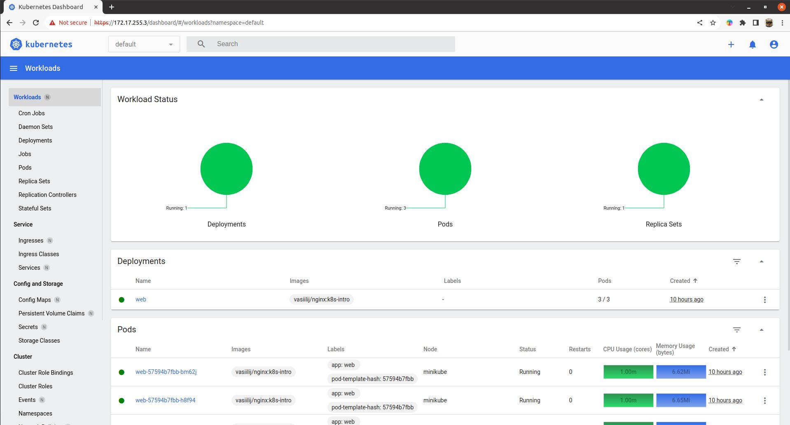
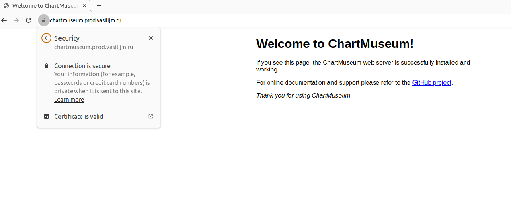
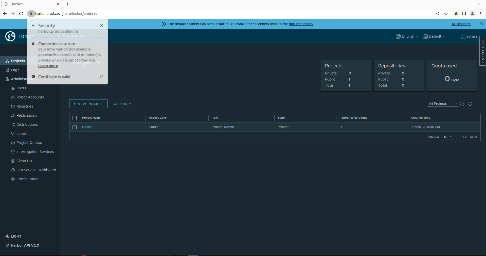
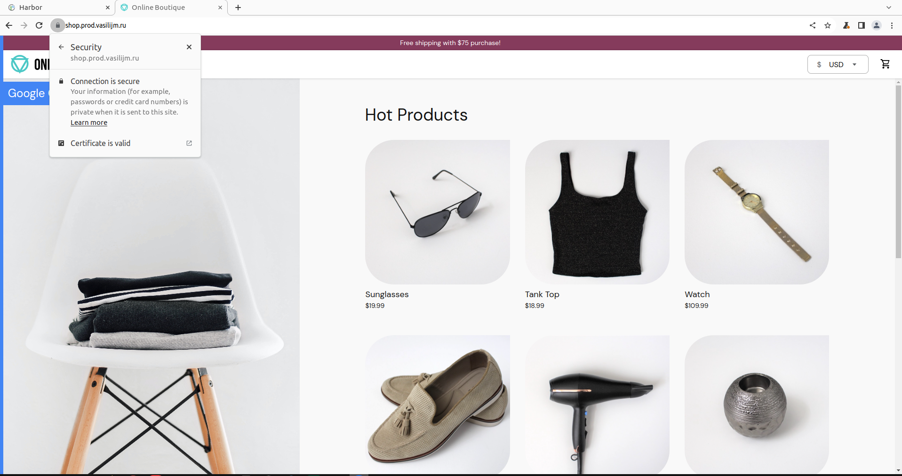
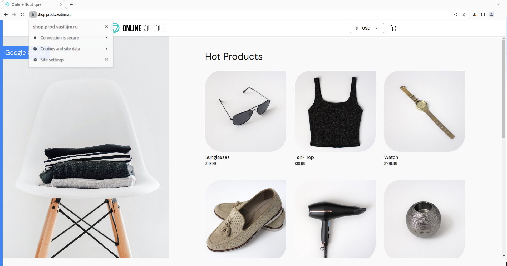
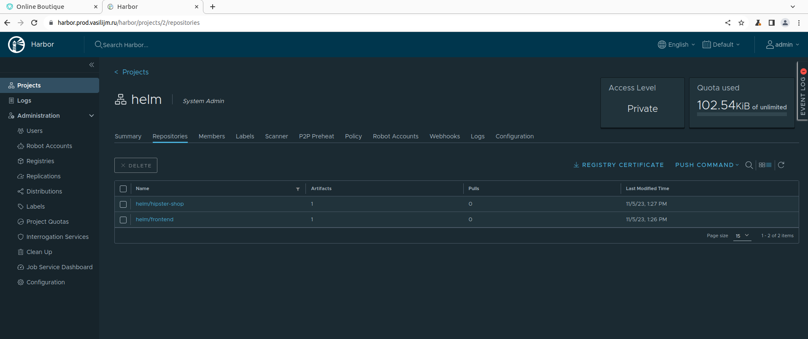

# vasilij-m_platform
vasilij-m Platform repository

## 1. Знакомство с Kubernetes, основные понятия и архитектура

<details>
  <summary><b>Выполнение заданий</b></summary>
  
  ### Задание 1
---
  **Вопрос:**  
    Разберитесь почему все pod в namespace `kube-system` восстановились после удаления.

  **Ответ:**  
    В нэймспейсе `kube-system` (minikube) запускаются следующие поды:  
    - coredns  
    - etcd  
    - kube-apiserver  
    - kube-controller-manager  
    - kube-proxy  
    - kube-scheduler  
    - registry  
    - registry-proxy  

  Поды `etcd`, `kube-apiserver`, `kube-controller-manager` и `kube-scheduler` являются static подами. Такие поды управляются напрямую `kubelet`'ом без участия компонентов Control Plane. `kubelet` следит за созданием/обновлением манифестов в директории `/etc/kubernetes/manifests` (по дефолту) и создает описанные в них поды без обращения к `kube-apiserver`. Собственно сам `kube-apiserver` и другие компоненты Control Plane создаются `kubelet`'ом при бутстрапе кластера (на самом деле это зависит от способа развертывания кластера, и Control Plane компоненты могут быть подняты как systemd сервисы, тогда манифесты для запуска их в виде static подов не нужны, как и сам `kubelet` на мастер-нодах).  
  При удалении этих подов из нэймспейса `kube-system` kubelet заново их поднимает, опираясь на манифесты в директории `/etc/kubernetes/manifests`.

  Под `coredns` заново поднимается после удаления, так как `coredns` является `deployment`'ом, и `deployment` контроллер следит, чтобы в кластере всегда было количество реплик, указанное в манифесте этого `deployment`.

  Поды `kube-proxy` и `registry-proxy` поднимаются, так как развернуты в кластере в составе `replicaset`, а `registry` - в составе `replicationcontroller`. Поведение этих контроллеров при удалении подов не отличается от `deployment`'а - они всегда восстанавливают в кластере то количество реплик, которое указано в их манифесте.

  ### Задание 2
---
  **Выполнение**
  
  1. Написан Dockerfile, запускающий web-сервер NGINX на порту `8000`, отдающий содержимое директории `/app` внутри контейнера (например, если в директории `/app` лежит файл `homework.html`, то при запуске контейнера данный файл должен быть доступен по URL `http://localhost:8000/homework.html`) и работающий с UID `1001`.   
  Dockerfile и конфиг для NGINX находится в директории `kubernetes-intro/web`. Образ собран и загружен в Docker Hub под тегом `vasiilij/nginx:k8s-intro`.

  2. Создан манифест `kubernetes-intro/web-pod.yaml` для запуска пода с контейнером на основе образа `vasiilij/nginx:k8s-intro`.

  3. В под к основному контейнеру добавлен init контейнер, генерирующий страницу `index.html`.

  4. Работоспособность приложения проверена (скриншот ниже):
  

  ### Hipster Shop | Задание со *
---
  **Выполнение**
  
  1. Причиной, по которой падал pod `frontend`, было отсутствие переменных окружения, необходимых для работы приложения.

  2. Создан манифест `kubernetes-intro/frontend-pod-healthy.yaml`, в котором для контейнера `frontend` указаны необходимые переменные окружения.

</details>

## 2. Kubernetes controllers. ReplicaSet, Deployment, DaemonSet

<details>
  <summary><b>Выполнение заданий</b></summary>
  
  ### Задание 1 (Обновление ReplicaSet)
---
  **Вопрос:**  
    Почему обновление ReplicaSet не повлекло обновление запущенных pod?

  **Ответ:**  
    После изменения в манифесте ReplicaSet версии образа для контейнера `frontend` и применения этого манифеста, в кластере остались запущены поды со старой версией приложения, то есть новые поды не запустились вместо уже запущенных. Это произошло потому, что ReplicaSet следит только за тем, чтобы количество подов в кластере с определёнными лейблами (эти лейблы указаны в селекторе ReplicaSet), совпадало с числом реплик в поле `.spec.replicas`.  
    На момент изменения версии образа в спецификации ReplicaSet, количество запущенных контейнеров с лейблом `app: frontend` уже равнялось трём, поэтому ReplicaSet не стало пересоздавать новые поды с обновленной версией приложения.

  ### Задание 2 (Deployment | Задание со *)
---
  **Выполнение**
  
  ***Реализация аналога blue-green развертывания:***
  1. Развертывание трех новых pod
  2. Удаление трех старых pod

  Blue-green развертывание можно реализовать следующими параметрами секции `.spec` в манифесте deployment:

  ```yaml
  strategy:
    type: RollingUpdate
    rollingUpdate:
      maxSurge: 100%        # сразу будут подняты все реплики с новой версией приложения (maxSurge: 100%),
      maxUnavailable: 0     # при этом старые реплики будут удалены только после того, как новые реплики будут готовы (maxUnavailable: 0)
  ```

  Весь манифест находится в файле `kubernetes-controllers/paymentservice-deployment-bg.yaml`.

  ***Реализация аналога Reverse Rolling Update развертывания:***
  1. Удаление одного старого pod
  2. Создание одного нового pod
  3. …

  Reverse Rolling Update развертывание можно реализовать следующими параметрами секции `.spec` в манифесте deployment:

  ```yaml
  strategy:
    type: RollingUpdate
    rollingUpdate:
      maxSurge: 0          # новая реплика приложения поднимется только после того (maxSurge: 0),
      maxUnavailable: 1    # как одна старая будет удалена (maxUnavailable: 1), и так далее, пока все старые реплики не будут заменены новыми
  ```

  Весь манифест находится в файле `kubernetes-controllers/paymentservice-deployment-reverse.yaml`.

  ### Задание 3 (Probes)
---
  **Выполнение**
  
  Создан манифест `kubernetes-controllers/frontend-deployment.yaml`, в котором добавлена Readiness Probe для периодеческого опроса эндпойнта `/_healthz` для контейнера `server`.

  ### Задание 4 (DaemonSet | Задание со *)
---
  **Выполнение**
  
  В кластере был развернут Node Exporter в виде DaemonSet.

  За основу манифеста `kubernetes-controllers/node-exporter-daemonset.yaml` был взят сгенерированный манифест `daemonset.yaml` из шаблона helm-чарта `prometheus-community/prometheus-node-exporter` командой `helm template`.

  На скриншоте показано, что поды с Node Exporter запустились только на worker нодах:
  

  Для проверки, что метрики отдаются, после применения манифеста `node-exporter-daemonset.yaml` необходимо:
  1. Пробросить порт в любой под с Node Exporter: `kubectl port-forward prometheus-node-exporter-6gqrn 9100:9100`
  2. Запросить метрики командой `curl localhost:9100/metrics` или открыть в браузере адрес http://localhost:9100/metrics

  ### Задание 5 (DaemonSet | Задание со **)
---
  **Выполнение**

  Для запуска подов с Node Exporter на Control plane нодах в манифест `kubernetes-controllers/node-exporter-daemonset.yaml` необходимо добавить параметры `tolerations` в `.spec.template.spec`:

  ```yaml
  tolerations:
    - key: node-role.kubernetes.io/control-plane
      operator: Exists
      effect: NoSchedule
  ```

  Это укажет планировщику Kubernetes Scheduler для подов с Node Exporter игнорировать taint `node-role.kubernetes.io/control-plane:NoSchedule`, который добавлен на Control plane ноды кластера.

  После применения манифеста `kubernetes-controllers/node-exporter-daemonset.yaml` с параметрами tolerations под с Node Exporter окажется запущен также и на Control plane ноде:
  

</details>

## 3. Настройка сетевой связности для приложения. Добавление service, ingress. Установка MetalLB

<details>
  <summary><b>Выполнение заданий</b></summary>

  ### Задание 1 (Добавление проверок Pod)
---
  **Вопрос:**  
  Почему следующая конфигурация валидна, но не имеет смысла?
  
  ```yaml
  livenessProbe:
    exec:
      command:
        - 'sh'
        - '-c'
        - 'ps aux | grep my_web_server_process'
  ```

  **Ответ:**  
  Код возврата данной команды всегда будет равен 0, вследствие чего данная livenessProbe всегда будет успешно проходить. Возможно такая проверка будет иметь смысл, если `my_web_server_process` не является основным процессом в поде (то есть его PID не равен 1), но он должен быть запущен в поде после основного. Тогда в этом случае необходимо добавить в команду дополнительную обработку, чтобы `grep` возвращал код `1`, если процесса `my_web_server_process` нет среди запущенных.


  ### Установка MetalLB
---
  MetalLB позволяет запустить внутри кластера L4-балансировщик, который будет принимать извне запросы к сервисам и раскидывать их между подами.  
  
  Для его установки нужно:
  
  1. Включить `IPVS` в `kube-proxy`, отредактировав `kube-proxy` configmap:
  ```bash
  kubectl edit configmap -n kube-system kube-proxy
  ```

  ```yaml
  apiVersion: kubeproxy.config.k8s.io/v1alpha1
  kind: KubeProxyConfiguration
  mode: "ipvs"
  ipvs:
    strictARP: true
  ```

  2. Установить Metallb, применив манифест: 
  ```bash
  kubectl apply -f https://raw.githubusercontent.com/metallb/metallb/v0.13.9/config/manifests/metallb-native.yaml
  ```

  3. Далее нужно определить пул IP адресов, которые MetalLB будет назначать сервисам с типом `LoadBalancer`. Сделать это можно, создав ресурс с типом `IPAddressPool` (для Layer 2 режима также нужно создать ресурс `L2Advertisement`):
  ```bash
  kubectl apply -f metallb-config.yaml
  ```

  ```yaml
  ---
  apiVersion: metallb.io/v1beta1
  kind: IPAddressPool
  metadata:
    name: default
    namespace: metallb-system
  spec:
    addresses:
    - 172.17.255.1-172.17.255.255

  ---
  apiVersion: metallb.io/v1beta1
  kind: L2Advertisement
  metadata:
    name: minikube
    namespace: metallb-system
  spec:
    ipAddressPools:
    - default
  ```

  ### MetalLB | Проверка конфигурации
---
  1. Применим манифест `./kubernetes-networks/web-svc-lb.yaml`, который создаст сервис с типом `Loadbalancer`, после чего увидим, что MetalLB назначил нашему сервису IP адрес (`EXTERNAL-IP`) из пула `default`:
  ```bash
  $ kubectl get svc web-svc-lb 
  NAME         TYPE           CLUSTER-IP      EXTERNAL-IP    PORT(S)        AGE
  web-svc-lb   LoadBalancer   10.105.40.111   172.17.255.1   80:32694/TCP   6s  
  ```

  2. Добавим маршрут в нашей зостовой ОС до подсети `172.17.255.0/24` через IP адрес `Minikube`:
  ```bash
  sudo ip route add 172.17.255.0/24 via 192.168.49.2
  ```
  
  3. Далее можно пройти в браузере на страницу `http://172.17.255.1/index.html` и убедиться, что наше приложение работает.


  ### Задание со * | DNS через MetalLB
---
  В манифесте `./kubernetes-networks/coredns/dns-svc-lb.yaml` описаны два сервиса с типом `Loadbalancer`. Эти сервисы после создания позволяют обращаться к внутрикластернему DNS (CoreDNS) из внешней сети. Так как Kubernetes в настоящее время не поддерживает мультипротокольные сервисы LoadBalancer, то для каждого протокола (TCP и UDP) необходимо создать свой сервис. Но чтобы этим сервисам был назначен один и тот же IP адрес, нужно в аннотации `metallb.universe.tf/allow-shared-ip` указать одинаковый общий ключ.

  После применения манифеста `./kubernetes-networks/coredns/dns-svc-lb.yaml` обоим сервисам будет назначен одинаковый IP адрес:
  ```bash
  $ kubectl get svc -n kube-system                 
  NAME             TYPE           CLUSTER-IP       EXTERNAL-IP    PORT(S)                  AGE
  dns-svc-lb-tcp   LoadBalancer   10.99.195.178    172.17.255.2   53:31644/TCP             13s
  dns-svc-lb-udp   LoadBalancer   10.102.217.198   172.17.255.2   53:30531/UDP             13s
  ```

  Теперь мы можем получить IP адрес, назначенный какому-либо сервису, обратившись к CoreDNS кластера, например:
  ```bash
  $ nslookup web-svc-lb.default.svc.cluster.local 172.17.255.2
  Server:		172.17.255.2
  Address:	172.17.255.2#53

  Name:	web-svc-lb.default.svc.cluster.local
  Address: 10.105.40.111  
  ```

  ### Создание Ingress
---
  1. Для установки NGINX ingress контроллера применим манифест:
  ```bash
  kubectl apply -f https://raw.githubusercontent.com/kubernetes/ingress-nginx/controller-v1.8.2/deploy/static/provider/baremetal/deploy.yaml
  ```

  Далее дождемся запуска пода с контроллером:
  ```
  $ kubectl get pods -n ingress-nginx -w 
  NAME                                        READY   STATUS      RESTARTS   AGE
  ingress-nginx-admission-create-gzcwm        0/1     Completed   0          2m3s
  ingress-nginx-admission-patch-7xv82         0/1     Completed   0          2m3s
  ingress-nginx-controller-79bc9f5df8-l82wx   1/1     Running     0          2m3s
  ```
  
  2. Создадим `LoadBalancer` сервис `ingress-nginx`:
  ```bash
  kubectl apply -f nginx-lb.yaml
  ```

  Проверим, что MetalLB назначил сервису IP адрес:
  ```bash
  $ kubectl -n ingress-nginx get svc                                                                        
  NAME                                 TYPE           CLUSTER-IP      EXTERNAL-IP    PORT(S)                      AGE
  ingress-nginx                        LoadBalancer   10.110.20.187   172.17.255.3   80:31497/TCP,443:30753/TCP   17s
  ingress-nginx-controller             NodePort       10.98.0.50      <none>         80:30747/TCP,443:31679/TCP   7m38s
  ingress-nginx-controller-admission   ClusterIP      10.109.153.7    <none>         443/TCP                      7m38s
  ```
  
  3. Создадим Headless-сервис для проксирования запросов в наше приложение. Headless-сервис - это просто А-запись в CoreDNS, т.е. имя сервиса преобразуется не в виртуальный IP (как раз его нет - `clusterIP: None` в манифесте), а сразу в IP нужного пода. Применим манифест `./kubernetes-networks/web-svc-headless.yaml` и убедимся, что ClusterIP действительно не был назначен:
  ```bash
  kubectl apply -f web-svc-headless.yaml
  ```

  ```bash
  $ kubectl get svc web-svc               
  NAME      TYPE        CLUSTER-IP   EXTERNAL-IP   PORT(S)   AGE
  web-svc   ClusterIP   None         <none>        80/TCP    54s  
  ```

  4. Создадим ресурс `Ingress` из манифеста `./kubernetes-networks/web-ingress.yaml` для того, чтобы в конфигурации ingress-контроллера появились нужные правила:
  ```bash
  kubectl apply -f web-ingress.yaml
  ```

  Проверим, что корректно заполнены Address и Backends:
  ```bash
  $ kubectl describe ingress/web
  Name:             web
  Labels:           <none>
  Namespace:        default
  Address:          192.168.49.2
  Ingress Class:    <none>
  Default backend:  <default>
  Rules:
    Host        Path  Backends
    ----        ----  --------
    *           
                /web(/|$)(.*)   web-svc:8000 (10.244.0.4:8000,10.244.0.5:8000,10.244.0.6:8000)
  Annotations:  kubernetes.io/ingress.class: nginx
                nginx.ingress.kubernetes.io/rewrite-target: /$2
  Events:
    Type    Reason  Age                  From                      Message
    ----    ------  ----                 ----                      -------
    Normal  Sync    54s (x4 over 5m52s)  nginx-ingress-controller  Scheduled for sync
  ```

  5. Теперь можно проверить, что приложение доступно в браузере по адресу `http://172.17.255.3/web/index.html`.


  ### Задание со * | Ingress для Dashboard
---
  1. Для установки Dashboard применим манифесты из директории `./kubernetes-networks/dashboard` (за основу манифестов взят [официальный манифест](https://raw.githubusercontent.com/kubernetes/dashboard/v2.7.0/aio/deploy/recommended.yaml) по установке Dashboard):
  ```bash
  kubectl apply -f dashboard/namespace.yaml && sleep 2 && kubectl apply -f dashboard
  ```

  2. Для доступа к Dashboard через Ingress-контроллер (через префикс `/dashboard`) описан Ingress ресурс в манифесте `./kubernetes-networks/dashboard/ingress.yaml`

  3. После создания всех русурсов в кластере необходимо получить токен от сервис-аккаунта `admin-user`. Сделать это можно командой:
  ```bash
  kubectl get secret admin-user -n kubernetes-dashboard -o jsonpath={".data.token"} | base64 -d
  ```
  
  4. Далее можно выполнить вход в Dasboard в браузере на странице `https://172.17.255.3/dashboard`, введя полученный токен:
  


  ### Задание со * | Canary для Ingress
---
  Для реализации канареечного развертывания с помощью ingress-nginx были написаны манифесты в директории `./kubernetes-networks/canary`. После их применения в нэймспейсе `canary` будут созданы ресурсы для `app-main` и `app-canary` приложений, которые по факту являются веб-серверами NGINX, отдающими страницу, содержащую имя хоста, IP-адрес и порт, а также URI запроса и местное время веб-сервера.

  1. Применим манифесты:
  ```bash
  kubectl apply -f canary/namespace.yaml && sleep 2 && kubectl apply -f canary
  ```

  2. Проверим созданные ресурсы:
  ```bash
  $ kubectl -n canary get all && kubectl -n canary get ingress
  NAME                             READY   STATUS    RESTARTS   AGE
  pod/app-canary-86fdf78c8-jjxfw   1/1     Running   0          5m3s
  pod/app-main-5857f664f-c2g7q     1/1     Running   0          5m3s

  NAME                 TYPE        CLUSTER-IP   EXTERNAL-IP   PORT(S)    AGE
  service/app-canary   ClusterIP   None         <none>        8000/TCP   5m3s
  service/app-main     ClusterIP   None         <none>        8000/TCP   5m3s

  NAME                         READY   UP-TO-DATE   AVAILABLE   AGE
  deployment.apps/app-canary   1/1     1            1           5m3s
  deployment.apps/app-main     1/1     1            1           5m3s

  NAME                                   DESIRED   CURRENT   READY   AGE
  replicaset.apps/app-canary-86fdf78c8   1         1         1       5m3s
  replicaset.apps/app-main-5857f664f     1         1         1       5m3s
  NAME     CLASS   HOSTS   ADDRESS        PORTS   AGE
  canary   nginx   *       192.168.49.2   80      19s
  main     nginx   *       192.168.49.2   80      19s
  ```

  3. Ingress с canary развертыванием описан в файле `./kubernetes-networks/canary/ingress-canary.yaml`. Благодаря этому Ingress трафик с заголовком `canary` будет попадать на приложение `app-canary`, в то время как трафик без этого заголовка пойдет на приложение `app-main`:

  Сначала отправим запросы с хедером `canary` с различными значениями и убедимся, что ответ приходит от приложения `app-canary`:
  ```bash
  $ curl -s -H "canary: 1" http://172.17.255.3/canary 
  Server address: 10.244.0.21:8080
  Server name: app-canary-6684864d55-4b2nn
  Date: 25/Sep/2023:21:16:18 +0000
  URI: /
  Request ID: 2829ee866139dfbca468fc729d4c6296

  $ curl -s -H "canary: 2" http://172.17.255.3/canary
  Server address: 10.244.0.21:8080
  Server name: app-canary-6684864d55-4b2nn
  Date: 25/Sep/2023:21:16:22 +0000
  URI: /
  Request ID: 81b44c0e64e23c6d81c644523e5a2457

  $ curl -s -H "canary: test" http://172.17.255.3/canary
  Server address: 10.244.0.21:8080
  Server name: app-canary-6684864d55-4b2nn
  Date: 25/Sep/2023:21:16:27 +0000
  URI: /
  Request ID: bb54bb77012a593d1d00e6cc251fb2fa
  ```

  Теперь отправим запросы с любым хедером и без него и убедимся, что ответ приходит от приложения `app-main`:
  ```bash
  $ curl -s -H "sparrow: captain" http://172.17.255.3/canary
  Server address: 10.244.0.22:8080
  Server name: app-main-8bbb965c4-fbpzp
  Date: 25/Sep/2023:21:19:01 +0000
  URI: /
  Request ID: 1c384632a303ac7b2bca1cb218f1f3f4

  $ curl -s -H "x: y" http://172.17.255.3/canary
  Server address: 10.244.0.22:8080
  Server name: app-main-8bbb965c4-fbpzp
  Date: 25/Sep/2023:21:19:11 +0000
  URI: /
  Request ID: 5be2fa5ba4f27a7b44c1bdae66c14814

  $ curl -s http://172.17.255.3/canary 
  Server address: 10.244.0.22:8080
  Server name: app-main-8bbb965c4-fbpzp
  Date: 25/Sep/2023:21:19:17 +0000
  URI: /
  Request ID: a73ea4beff282ae51e753fee31821d4f
  ```
</details>

## 4. Настройка сервисных аккаунтов и ограничение прав для них

<details>
  <summary><b>Выполнение заданий</b></summary>

  ### Задание 1
---
  1. Создать Service Account `bob` , дать ему роль `admin` в рамках всего кластера
  2. Создать Service Account `dave` без доступа к кластеру

  **Выполнение**  

  1. Service Account `bob` и ClusterRoleBinding `admin-clusterrole` описаны в манифестах `./kubernetes-security/task01/01-sa-bob.yaml` и `./kubernetes-security/task01/02-clusterrolebinding-bob.yaml`.
  2. Service Account `dave` описан в манифесте `./kubernetes-security/task01/03-sa-dave.yaml`. Чтобы у `dave` не было доступа к кластеру достаточно просто не привязывать его к какой-либо роли через объекты RoleBinding/ClusterRoleBinding.

  ### Задание 2
---
  1. Создать Namespace `prometheus`
  2. Создать Service Account `carol` в этом Namespace
  3. Дать всем Service Account в Namespace `prometheus` возможность делать `get`, `list`, `watch` в отношении Pods всего кластера

  **Выполнение**

  1. Namespace `prometheus` описано в манифесте `./kubernetes-security/task02/01-namespace.yaml`.
  2. Service Account `carol` описан в манифесте `./kubernetes-security/task02/02-sa-carol.yaml`.
  3. Чтобы все сервисные аккаунты в Namespace `prometheus` имели возможность делать `get`, `list`, `watch` в отношении Pods всего кластера, нужно применить следующие манифесты:
     1.  `./kubernetes-security/task02/03-clusterrole-pods-viewer.yaml` - описывает ClusterRole `pods-viewer`
     2.  `./kubernetes-security/task02/04-clusterrolebinding-pods-viewer.yaml` - описывает ClusterRoleBinding `serviceaccounts-pods-viewer` (привязывает сервисные аккаунты из Namespace `prometheus` к ClusterRole `pods-viewer`).

  ### Задание 3
---
  1. Создать Namespace `dev`
  2. Создать Service Account `jane` в Namespace `dev`
  3. Дать `jane` роль `admin` в рамках Namespace `dev`
  4. Создать Service Account `ken` в Namespace `dev`
  4. Дать `ken` роль `view` в рамках Namespace `dev`

  **Выполнение**
  
  1. Namespace `dev` описано в манифесте `./kubernetes-security/task03/01-namespace.yaml`.
  2. Service Account `jane` описан в манифесте `./kubernetes-security/task03/02-sa-jane.yaml`.
  3. Манифест `./kubernetes-security/task03/03-rolebinding-jane.yaml` - описывает RoleBinding `jane-admin` в рамках Namespace `dev` (привязывает сервисный аккаунт `jane` из Namespace `dev` к ClusterRole `admin`).
  4. Service Account `ken` описан в манифесте `./kubernetes-security/task03/04-sa-ken.yaml`.
  5. Манифест `./kubernetes-security/task03/05-rolebinding-ken.yaml` - описывает RoleBinding `ken-view` в рамках Namespace `dev` (привязывает сервисный аккаунт `ken` из Namespace `dev` к ClusterRole `view`).

</details>

## 5. Работа с PVC, PV, хранение данных внутри k8s

<details>
  <summary><b>Выполнение заданий</b></summary>

  ### Задание 1. Применение StatefulSet
---
  **Выполнение**  

  Для развертывания MinIO применим манифест `./kubernetes-volumes/minio-statefulset.yaml`:
  ```bash
  kubectl apply -f kubernetes-volumes/minio-statefulset.yaml
  ```

  В результате в кластере будут созданы следующие объекты: 
  1. Под `minio-0`
     ```bash
     $ kubectl get pods                                       
     NAME      READY   STATUS    RESTARTS   AGE
     minio-0   1/1     Running   0          119s
     ```
  2. PVC `data-mino-0`
     ```bash
     $ kubectl get pvc 
     NAME           STATUS   VOLUME                                     CAPACITY   ACCESS MODES   STORAGECLASS   AGE
     data-minio-0   Bound    pvc-ffe3c691-5769-47f2-98ed-e13a1b99be89   10Gi       RWO            standard       5m24s
     ```
  3. Динамически создаться PV на этом PVC с помощью дефолотного StorageClass
     ```bash
     $ kubectl get pv 
     NAME                                       CAPACITY   ACCESS MODES   RECLAIM POLICY   STATUS   CLAIM                  STORAGECLASS   REASON   AGE
     pvc-ffe3c691-5769-47f2-98ed-e13a1b99be89   10Gi       RWO            Delete           Bound    default/data-minio-0   standard                7m12s
     ```

  ### Задание 2. Применение Headless Service
---
  **Выполнение**

  Для того, чтобы StatefulSet с MinIO был доступен изнутри кластера, создадим Headless Service, применив манифест `./kubernetes-volumes/minio-headless-service.yaml`:
  ```bash
  kubectl apply -f kubernetes-volumes/minio-headless-service.yaml
  ```
  Результат:
  ```bash
  $ kubectl get svc                                        
  NAME         TYPE        CLUSTER-IP   EXTERNAL-IP   PORT(S)    AGE
  kubernetes   ClusterIP   10.96.0.1    <none>        443/TCP    25m
  minio        ClusterIP   None         <none>        9000/TCP   20s  
  ```
  
  ### Задание 3. Проверка работы MinIO
--- 
  **Выполнение**

  Проверить работу Minio можно с помощью консольного клиента [mc](https://github.com/minio/mc).

  1. Скачаем его бинарь:
     ```bash
     curl -o /tmp/mc https://dl.min.io/client/mc/release/linux-amd64/mc
     chmod +x /tmp/mc
     ```

  2. Пробросим порт, чтобы можно было подключиться к MinIO снаружи кластера:
     ```bash
     kubectl port-forward service/minio 9000:9000
     ```
  3. Создадим alias для удобства подключения к MinIO:
     ```bash
     $ /tmp/mc alias set myminio http://localhost:9000 minio minio123
     Added `myminio` successfully.
     ```
  4. Протестируем соединение:
     ```bash
     $ /tmp/mc admin info myminio
     ●  localhost:9000
        Uptime: 33 minutes 
        Version: 2023-09-30T07:02:29Z
        Network: 1/1 OK 
        Drives: 1/1 OK 
        Pool: 1 
     
     Pools:
        1st, Erasure sets: 1, Drives per erasure set: 1 
     
     1 drive online, 0 drives offline     
     ```
  5. Создадим бакет и загрузим файл в MinIO:

     Содержимое файла:
     ```bash
     $ cat /tmp/minio_test                                                     
     This is for MinIO test
     ```
     Создадим бакет:
     ```bash
     $ /tmp/mc mb --with-lock myminio/mydata
     Bucket created successfully `myminio/mydata`.
     ```
     Загрузим файл в бакет:
     ```bash
     $ /tmp/mc cp /tmp/minio_test myminio/mydata/
     /tmp/minio_test:            23 B / 23 B ━━━━━━━━━━━━━━━━━━━━━━━━━━━━━━━━━━━━━━━━━━━━━━━━━━━━━━━━━━━━━━━━━━━━━━━━━━━━━━━━━━━━━━━━━━━━━━━━━ 4.21 KiB/s 0s
     ```
     Проверим, что файл действительно загрузился:
     ```bash
     $ /tmp/mc ls --recursive --versions myminio/mydata
     [2023-10-04 23:42:53 MSK]    23B STANDARD 613164d5-ba48-4699-825a-31369a72bbbf v1 PUT minio_test
     ```
  6. Удалим под minio-0 и убедимся, что после его пересоздания наш файл будет на месте:
     ```bash
     $ kubectl delete pod minio-0
     pod "minio-0" deleted
     $ kubectl get pod           
     NAME      READY   STATUS    RESTARTS   AGE
     minio-0   1/1     Running   0          61s
     ```
     Под пересоздался с тем же именем, проверим, что файл на месте.  
     Сначала заново пробросим порт:
     ```bash
     kubectl port-forward service/minio 9000:9000
     ```
     Проверим файл:
     ```bash
     $ /tmp/mc ls --recursive --versions myminio/mydata
     [2023-10-04 23:42:53 MSK]    23B STANDARD 613164d5-ba48-4699-825a-31369a72bbbf v1 PUT minio_test
     ```
     Скопируем файл к себе на localhost:
     ```bash
     $ /tmp/mc cp myminio/mydata/minio_test /tmp/from_minio_test
     ...:9000/mydata/minio_test: 23 B / 23 B ━━━━━━━━━━━━━━━━━━━━━━━━━━━━━━━━━━━━━━━━━━━━━━━━━━━━━━━━━━━━━━━━━━━━━━━━━━━━━━━━━━━━━━━━━━━━━━━━━ 3.13 KiB/s 0s
     ```
     Проверим сдержимое файла:
     ```bash
     $ cat /tmp/from_minio_test
     This is for MinIO test
     ```

  ### Задание 4 со *. Поместите данные в и настройте конфигурацию на их использование.
--- 
  **Выполнение**
  
  1. Создадим Secret с именем пользователя и паролем для аутентификации в MinIO, применив манифест `./kubernetes-volumes/minio-secret.yaml`:

     ```bash
     kubectl apply -f kubernetes-volumes/minio-secret.yaml
     ```
  2. Далее вместо блока `env` в спецификации контейнера добавим блок `envFrom` со ссылкой на имя созданного в предыдущем пункте серкрета:
     ```yaml
     apiVersion: apps/v1
     kind: StatefulSet
     metadata:
       name: minio
     ...
     spec:
       ...
       template:
         ...
         spec:
           containers:
             - name: minio
               envFrom:
                 - secretRef:
                     name: minio-auth
           ...
     ```
  3. После удаления и создания StatefulSet `minio` заново, мы все также имеем доступ к MinIO с ранее добавленными кредами:
     ```bash
     $ /tmp/mc admin info myminio                               
     ●  localhost:9000
        Uptime: 24 seconds 
        Version: 2023-09-30T07:02:29Z
        Network: 1/1 OK 
        Drives: 1/1 OK 
        Pool: 1
     
     Pools:
        1st, Erasure sets: 1, Drives per erasure set: 1
     
     23 B Used, 1 Bucket, 1 Object, 1 Version
     1 drive online, 0 drives offline
     ```

</details>

## 6. Шаблонизация манифестов приложения, использование Helm, kustomize, helmfile, jsonnet. Установка community Helm charts

<details>
  <summary><b>Выполнение заданий</b></summary>

  ### Задание 1. nginx-ingress
---
  **Выполнение**  

  1. Добавим репозиторий `ingress-nginx`:
      ```bash
      helm repo add ingress-nginx https://kubernetes.github.io/ingress-nginx
      helm repo update
      ```
  2. Создадим release `ingress-nginx` с одновременным созданием namespace для него:
      ```bash
      helm install ingress-nginx ingress-nginx/ingress-nginx --namespace ingress-nginx --create-namespace --version 4.8.2 --set controller.service.loadBalancerIP="158.160.47.79"
      ```
  3. Проверим, что ingress-контроллер запущен:
      ```bash
      $ kubectl get pods -n ingress-nginx    
      NAME                                        READY   STATUS    RESTARTS   AGE
      ingress-nginx-controller-667587fcc7-whks7   1/1     Running   0          78s
      ```

  ### Задание 2. cert-manager
---
  **Выполнение**  

  1. Добавим репозиторий `jetstack`:
      ```bash
      helm repo add jetstack https://charts.jetstack.io
      helm repo update
      ```
  2. cert-manager требует наличия в кластере определенных CRD, установим их:
      ```bash
      kubectl apply -f https://github.com/cert-manager/cert-manager/releases/download/v1.13.1/cert-manager.crds.yaml
      ```
  3. Создадим release `cert-manager` с одновременным созданием namespace для него:
      ```bash
      helm upgrade --install cert-manager jetstack/cert-manager --namespace cert-manager --create-namespace --version v1.13.1 --wait
      ```
  4. После установки `cert-manager` необходимо добавить `Issuer` или `ClusterIssuer` (то же что `Issuer`, но с его помощью можно выпускать сертификаты в любом namespace кластера). Это ресурсы, которые представляют центры сертификации (CAs), способные генерировать подписанные сертификаты в ответ на запросы на подпись (certificate signing requests, CSR).   
   
      Манифесты ресурса `ClusterIssuer`, который будет отвечать на HTTP01 challenges при выпуске сертификатов, описаны в файлах `./kubernetes-templating/cert-manager/cluster-issuer-le-staging.yaml` (для выпуска сертификатов от Let's Encrypt в тестовых сценариях) и `./kubernetes-templating/cert-manager/cluster-issuer-le-prod.yaml` (для выпуска сертификатов от LetsEncrypt в prod сценариях).

      Применим эти манифесты:
      ```bash
      kubectl apply -f ./kubernetes-templating/cert-manager/cluster-issuer-le-staging.yaml -f ./kubernetes-templating/cert-manager/cluster-issuer-le-prod.yaml
      ```

  ### Задание 3. chartmuseum
---
  **Выполнение**  

  1. Добавим репозиторий `chartmuseum`:
      ```bash
      helm repo add chartmuseum https://chartmuseum.github.io/charts
      helm repo update
      ```

  2. В файле `./kubernetes-templating/chartmuseum/values.yaml` описаны параметры для деплоя chartmuseum с помощью helm чарта. В этих значениях я настроил:
     1. Создание ingress ресурса с `hosts.name` `chartmuseum.prod.vasilijm.ru` (поддомен `prod.vasilijm.ru` я делегировал под управление Yandex Cloud DNS)
     2. Автоматическую генерацию Let's Encrypt сертификата

  3. Создадим release `chartmuseum` с одновременным созданием namespace для него:
      ```bash
      helm upgrade --install chartmuseum chartmuseum/chartmuseum -f ./kubernetes-templating/chartmuseum/values.yaml --namespace chartmuseum --create-namespace --version 3.1.0 --wait
      ```
  4. Проверим, что соединение с `chartmuseum.prod.vasilijm.ru` защищено (т.е. сертификат от Let's Encrypt получен с помощью cert-manager):
  

  ### Задание 4 со *. chartmuseum - Научитесь работать с chartmuseum
---
  **Выполнение**  

  1. Для работы с chartmuseum из helm есть [helm-push plugin](https://github.com/chartmuseum/helm-push):
     1. Установим его:
        ```bash
        helm plugin install https://github.com/chartmuseum/helm-push
        ```
     2. Добавим репозиторий `myrepo`:
        ```bash
        $ helm repo add myrepo https://chartmuseum.prod.vasilijm.ru
        "myrepo" has been added to your repositories
        ```
     3. Запушим в репозиторий `myrepo` чарт `ingress-nginx`, который сохранен локально как директория соответсвтующей для данного чарта структурой:
        ```bash
        $ helm cm-push ../misc/helm-charts/ingress-nginx/ myrepo        
        Pushing ingress-nginx-4.8.2.tgz to myrepo...
        Done.
        ```
     4. После обновления информации о helm репозиториях (`helm repo update`) можно увидеть, что в `myrepo` появился чарт `myrepo/ingress-nginx`:
        ```bash
        $ helm search repo myrepo/
        NAME                	CHART VERSION	APP VERSION	DESCRIPTION                                       
        myrepo/ingress-nginx	4.8.2        	1.9.3      	Ingress controller for Kubernetes using NGINX a...
        ```
     5. Теперь можно будет установить данный чарт командой `helm install ingress-nginx myrepo/ingress-nginx`.

  ### Задание 5. harbor
---
  **Выполнение** 

  1. Добавим репозиторий `harbor`:
      ```bash
      helm repo add harbor https://helm.goharbor.io
      helm repo update
      ```
  2. Для установки harbor используем параметры, указанные в файле `./kubernetes-templating/harbor/values.yaml`. Среди параметров:
     1. Включен `ingress` и настроен `host` `harbor.prod.vasilijm.ru`
     2. Включен TLS и выписан валидный сертификат
     3. Сервис `notary` выключен за ненадобностью
     4. Выключен IPv6

     Создадим release `harbor` с одновременным созданием namespace для него:
      ```bash
      helm upgrade --install harbor harbor/harbor -f ./kubernetes-templating/harbor/values.yaml --namespace harbor --create-namespace --version 1.13.0 --wait
      ```
  3. Проверим, что соединение с `harbor.prod.vasilijm.ru` защищено (т.е. сертификат от Let's Encrypt получен с помощью cert-manager):
  

  ### Задание 6 со *. используем helmfile
---
  **Выполнение**  

  Для одновременной установки `nginx-ingress`, `cert-manager` и `harbor` можно использовать helmfile `./kubernetes-templating/helmfile/helmfile.yaml`

  1. Установка `helmfile`:
      ```bash
      curl -L -O https://github.com/helmfile/helmfile/releases/download/v0.158.0/helmfile_0.158.0_linux_amd64.tar.gz
      ```
      ```bash
      tar xvf /tmp/helmfile_0.158.0_linux_amd64.tar.gz
      ```
      ```bash
      sudo mv helmfile /usr/local/bin
      ```
      ```bash
      $ helmfile version

      ▓▓▓ helmfile

        Version            0.158.0
        Git Commit         9596790
        Build Date         23 Oct 23 05:57 MSK (6 days ago)
        Commit Date        23 Oct 23 00:51 MSK (6 days ago)
        Dirty Build        no
        Go version         1.21.3
        Compiler           gc
        Platform           linux/amd64
      ```
  2. Находясь в директории `./kubernetes-templating/helmfile`, выполним следующие команды:
     1. Установим необходимые зависимости (это установит необходимые helm плагины):
        ```bash
        helmfile init --force
        ```
     2. Выполним обновление релизов:
        ```bash
        helmfile sync
        ```
        <details>
          <summary><b>Лог установки</b></summary>

          ```bash  
          Adding repo ingress-nginx https://kubernetes.github.io/ingress-nginx
          "ingress-nginx" has been added to your repositories

          Adding repo jetstack https://charts.jetstack.io
          "jetstack" has been added to your repositories

          Adding repo harbor https://helm.goharbor.io
          "harbor" has been added to your repositories

          Upgrading release=cert-manager, chart=jetstack/cert-manager
          Upgrading release=ingress-nginx, chart=ingress-nginx/ingress-nginx
          Upgrading release=harbor, chart=harbor/harbor
          Release "cert-manager" does not exist. Installing it now.
          NAME: cert-manager
          LAST DEPLOYED: Sun Nov  5 11:30:07 2023
          NAMESPACE: cert-manager
          STATUS: deployed
          REVISION: 1
          TEST SUITE: None
          NOTES:
          cert-manager v1.13.1 has been deployed successfully!

          In order to begin issuing certificates, you will need to set up a ClusterIssuer
          or Issuer resource (for example, by creating a 'letsencrypt-staging' issuer).

          More information on the different types of issuers and how to configure them
          can be found in our documentation:

          https://cert-manager.io/docs/configuration/

          For information on how to configure cert-manager to automatically provision
          Certificates for Ingress resources, take a look at the `ingress-shim`
          documentation:

          https://cert-manager.io/docs/usage/ingress/

          Listing releases matching ^cert-manager$
          cert-manager	cert-manager	1       	2023-11-05 11:30:07.33538939 +0300 MSK	deployed	cert-manager-v1.13.1	v1.13.1    

          Release "ingress-nginx" does not exist. Installing it now.
          NAME: ingress-nginx
          LAST DEPLOYED: Sun Nov  5 11:30:07 2023
          NAMESPACE: ingress-nginx
          STATUS: deployed
          REVISION: 1
          TEST SUITE: None
          NOTES:
          The ingress-nginx controller has been installed.
          It may take a few minutes for the LoadBalancer IP to be available.
          You can watch the status by running 'kubectl --namespace ingress-nginx get services -o wide -w ingress-nginx-controller'

          An example Ingress that makes use of the controller:
            apiVersion: networking.k8s.io/v1
            kind: Ingress
            metadata:
              name: example
              namespace: foo
            spec:
              ingressClassName: nginx
              rules:
                - host: www.example.com
                  http:
                    paths:
                      - pathType: Prefix
                        backend:
                          service:
                            name: exampleService
                            port:
                              number: 80
                        path: /
              # This section is only required if TLS is to be enabled for the Ingress
              tls:
                - hosts:
                  - www.example.com
                  secretName: example-tls

          If TLS is enabled for the Ingress, a Secret containing the certificate and key must also be provided:

            apiVersion: v1
            kind: Secret
            metadata:
              name: example-tls
              namespace: foo
            data:
              tls.crt: <base64 encoded cert>
              tls.key: <base64 encoded key>
            type: kubernetes.io/tls

          Listing releases matching ^ingress-nginx$
          ingress-nginx	ingress-nginx	1       	2023-11-05 11:30:07.753774222 +0300 MSK	deployed	ingress-nginx-4.8.2	1.9.3      


          hook[postsync] logs | clusterissuer.cert-manager.io/letsencrypt-staging created
          hook[postsync] logs | clusterissuer.cert-manager.io/letsencrypt-prod created
          hook[postsync] logs | 
          Release "harbor" does not exist. Installing it now.
          NAME: harbor
          LAST DEPLOYED: Sun Nov  5 11:30:07 2023
          NAMESPACE: harbor
          STATUS: deployed
          REVISION: 1
          TEST SUITE: None
          NOTES:
          Please wait for several minutes for Harbor deployment to complete.
          Then you should be able to visit the Harbor portal at https://harbor.prod.vasilijm.ru
          For more details, please visit https://github.com/goharbor/harbor

          Listing releases matching ^harbor$
          harbor	harbor   	1       	2023-11-05 11:30:07.413541574 +0300 MSK	deployed	harbor-1.13.0	2.9.0      


          UPDATED RELEASES:
          NAME            CHART                         VERSION   DURATION
          cert-manager    jetstack/cert-manager         v1.13.1        38s
          ingress-nginx   ingress-nginx/ingress-nginx   4.8.2          37s
          harbor          harbor/harbor                 1.13.0       1m49s
          ```

        </details>

  ### Задание 7. Создаем свой helm chart
---
  **Выполнение** 

  1. Инициализируем структуру helm чарта:
      ```bash
      helm create kubernetes-templating/hipster-shop
      ```
  2. Создадим релиз:
      ```bash
      helm upgrade --install hipster-shop kubernetes-templating/hipster-shop --namespace hipster-shop --create-namespace
      ```
  3. Создадим отдельный helm чарт для сервиса `frontend` и вынесем в него соответсвтующие ресурсы из `./kubernetes-templating/hipster-shop/templates/all-hipster-shop.yaml`:
      ```bash
      helm create kubernetes-templating/frontend
      ```
  4. Установим релиз `frontend` в нэймспэйс `hipster-shop`:
      ```bash
      helm upgrade --install frontend kubernetes-templating/frontend --namespace hipster-shop
      ```
  5. Проверим, что появился доступ к UI с использованием tls (https://shop.prod.vasilijm.ru):
      

  6. Укажем чарт `frontend` как зависимость в чарте `hipster-shop` (блок `dependencies` в файле `./kubernetes-templating/hipster-shop/Chart.yaml`).  
  После чего удалим release `frontend` из кластера:
      ```bash
      helm delete frontend -n hipster-shop
      ```
  7. Обновим зависимости:
      ```bash
      helm dep update kubernetes-templating/hipster-shop
      ```
      В директории `./kubernetes-templating/hipster-shop/charts` появился архив `frontend-0.1.0.tgz` содержащий chart `frontend` версии 0.1.0 и добавленный в chart `hipster-shop` как зависимость.
  8. Обновим release `hipster-shop` и убедимся, что ресурсы `frontend` вновь созданы:
      ```bash
      $ helm upgrade --install hipster-shop kubernetes-templating/hipster-shop --namespace hipster-shop                   
      Release "hipster-shop" has been upgraded. Happy Helming!
      NAME: hipster-shop
      LAST DEPLOYED: Sun Oct 29 23:30:17 2023
      NAMESPACE: hipster-shop
      STATUS: deployed
      REVISION: 4
      TEST SUITE: None
      $
      $ kubectl -n hipster-shop get all  | grep frontend
      pod/frontend-66985f459-hr87s                 1/1     Running            0              66s
      service/frontend                NodePort    10.96.165.236   <none>        80:31000/TCP   68s
      deployment.apps/frontend                1/1     1            1           67s
      replicaset.apps/frontend-66985f459                 1         1         1       67s
      ```

  ### Задание 8 со *. Выберите сервисы, которые можно установить как зависимости, используя community chart's
---
  **Выполнение** 

  1. Добавим чарт `redis` от bitnami в блок `dependencies` в файле `./kubernetes-templating/hipster-shop/Chart.yaml` и обновим зависимости:
      ```bash
      helm dep update kubernetes-templating/hipster-shop
      ```
      В директории `./kubernetes-templating/hipster-shop/charts` появился архив `redis-18.2.0.tgz` содержащий chart `redis` версии 18.2.0 и добавленный в chart `hipster-shop` как зависимость.

      Для сервиса `cartservice` необходимо поменять значение переменной, чтобы он смог установить подключение с redis по имени его сервиса:
      ```yaml
      - name: REDIS_ADDR
        value: "{{ .Values.redis.fullnameOverride }}-master:6379"
      ```
  2. Задеплоим релиз `hipster-shop` и убедимся, что сервис `cartservice` работает без ошибок, так как именно он взаимодейстует с redis:
      ```bash
      $ helm upgrade --install hipster-shop kubernetes-templating/hipster-shop --namespace hipster-shop --create-namespace
      ```
  3. Проверим, что появился доступ к UI с использованием tls (https://shop.prod.vasilijm.ru):
      

  ### Задание 9. Работа с helm-secrets
---
  **Выполнение** 

  Плагин `helm-secrets` используется для хранения в чарте секретов в зашифрованном виде.

  1. Установим плагин:
      ```bash
      helm plugin install https://github.com/jkroepke/helm-secrets --version v4.5.1
      ```
  2. Установим Mozilla SOPS:
      ```bash
      # Download the binary
      curl -LO https://github.com/getsops/sops/releases/download/v3.8.1/sops-v3.8.1.linux.amd64

      # Move the binary in to your PATH
      sudo mv sops-v3.8.1.linux.amd64 /usr/local/bin/sops

      # Make the binary executable
      sudo chmod +x /usr/local/bin/sops 
      ``` 
  3. Сгенерируем новый PGP ключ, ответив в процессе на вопросы:
      ```bash
      gpg --full-generate-key
      ```
  4. Создадим `./kubernetes-templating/frontend/secrets.yaml` со следующим сожержимым:
      ```yaml
      visibleKey: hiddenValue
      ```
     Зашифруем файл:
      ```bash
      sops -e -i --pgp B0FA8EFF80BB979847564414DFD56B4AFBDB33CB ./kubernetes-templating/frontend/secrets.yaml
      ```
  5. Содержимое файла изменилось, значение ключа `visibleKey` теперь зашифровано, плюс появилась дополнительная мета. Для просмотра зашифврованного значения можно воспользоваться одной из следующих команд:
      ```bash
      helm secrets decrypt ./kubernetes-templating/frontend/secrets.yaml
      ``` 
      ```bash
      sops -d ./kubernetes-templating/frontend/secrets.yaml
      ```
  6. Создадим secret в кластере (секрет описан в манифесте `./kubernetes-templating/frontend/templates/secret.yaml`). Для его создания выполним следующую команду:
      ```bash
      helm secrets upgrade --install frontend kubernetes-templating/frontend --namespace frontend --create-namespace \
      -f kubernetes-templating/frontend/values.yaml \
      -f kubernetes-templating/frontend/secrets.yaml
      ```
  7. Проверим, что секрет создан:
      ```bash
      $ kubectl -n frontend get secret secret -o yaml
      apiVersion: v1
      data:
        visibleKey: aGlkZGVuVmFsdWU=
      kind: Secret
      metadata:
        annotations:
          meta.helm.sh/release-name: frontend
          meta.helm.sh/release-namespace: frontend
        creationTimestamp: "2023-10-30T20:27:26Z"
        labels:
          app.kubernetes.io/managed-by: Helm
        name: secret
        namespace: frontend
        resourceVersion: "42688"
        uid: b8dfdea8-166c-4866-b17e-72187967e026
      type: Opaque      
      ```
  8. Q: *Предложите способ использования плагина helm-secrets в CI/CD*  
     A: В репозитории можно держать файлы с зашифрованными секретами, таким образом мы получаем секреты, актуальные для той или иной версии приложения. Затем при деплое с помощью плагина helm-secrets мы можем создавать в кластере kubernetes обеъекты `secret`, где данные будут уже расшифрованы и закодированы в base64.

     Q: *Про что необходимо помнить, если используем helm-secrets (например, как обезопасить себя от коммита файлов с секретами, которые забыл зашифровать)?*  
     A: Нужно проверять, чтобы секрет не попал в репозиторий в незашифрованном виде. В автоматическом режиме это можно реализовать в виде pre-commit хука.

  ### Задание 10. Проверка. Поместите все получившиеся helm chart's в ваш установленный harbor в публичный проект.
---
  **Выполнение** 

  У меня не получилось добавить репозиторий harbor командой `helm repo add templating https://harbor.prod.vasilijm.ru/helm`, так как получал ошибку:
  ```
  Error: looks like "https://harbor.prod.vasilijm.ru/helm" is not a valid chart repository or cannot be reached: error unmarshaling JSON: while decoding JSON: json: cannot unmarshal string into Go value of type repo.IndexFile  
  ```
  В итоге работа с helm чартами в Harbor выглядит следующим образом:
  1. В Harbor создать проект `helm` для хранения чартов
  2. Выполнить `helm login` для логина в репозиторий `helm`:
      ```bash
      $ helm registry login https://harbor.prod.vasilijm.ru/helm --username=admin --password=Harbor12345
      WARNING: Using --password via the CLI is insecure. Use --password-stdin.
      Login Succeeded
      ```
  3. Создать из директории чарта архив командой `helm package`:
      ```bash
      $ helm package --version 0.1.0 --destination /tmp kubernetes-templating/frontend
      Successfully packaged chart and saved it to: /tmp/frontend-0.1.0.tgz
      $
      $ helm package --version 0.1.0 --destination /tmp kubernetes-templating/hipster-shop 
      Successfully packaged chart and saved it to: /tmp/hipster-shop-0.1.0.tgz
      ```
  4. Командой `helm push` загрузить архив чарта в Harbor:
      ```bash
      $ helm push /tmp/frontend-0.1.0.tgz oci://harbor.prod.vasilijm.ru/helm 
      Pushed: harbor.prod.vasilijm.ru/helm/frontend:0.1.0
      Digest: sha256:0242cfe42fe9ed34a6eaf3984774d20d684705d2f5b0059fd674b4bffc6b5865
      $
      $ helm push /tmp/hipster-shop-0.1.0.tgz oci://harbor.prod.vasilijm.ru/helm
      Pushed: harbor.prod.vasilijm.ru/helm/hipster-shop:0.1.0
      Digest: sha256:d536e83df55545dc933d9b9d399cdd4f0fdc669a4d3d9ccd0e548468e61e3ede
      ```
  5. Для загрузки чартов в Harbor написан скрипт `./kubernetes-templating/repo.sh`, например, для загрузка чартов frontend и hipster-shop выглядит следующим образом:
      ```bash
      $ ./kubernetes-templating/repo.sh frontend hipster-shop
      WARNING: Using --password via the CLI is insecure. Use --password-stdin.
      Login Succeeded
      Successfully packaged chart and saved it to: /tmp/frontend-0.1.0.tgz
      Pushed: harbor.prod.vasilijm.ru/helm/frontend:0.1.0
      Digest: sha256:4367ad434f64e63e47be1e14f6e306095afd641aedc7ed12a0aa10c105fcc127
      Successfully packaged chart and saved it to: /tmp/hipster-shop-0.1.0.tgz
      Pushed: harbor.prod.vasilijm.ru/helm/hipster-shop:0.1.0
      Digest: sha256:0ab636497baa0b160c47611899573671f88ca8a76fa72baab8f4acab58e2ce3c
      ```
  6. Результат можно увидеть в интерфейе Harbor:
  

  ### Задание 11. Kubecfg
---
  **Выполнение** 

  1. Установим `kubecfg`:
      ```bash
      # Download the binary
      curl -LO https://github.com/kubecfg/kubecfg/releases/download/v0.34.2/kubecfg_Linux_X64

      # Move the binary in to your PATH
      sudo mv kubecfg_Linux_X64 /usr/local/bin/kubecfg

      # Make the binary executable
      sudo chmod +x /usr/local/bin/kubecfg 
      
      # Check version
      $ kubecfg version
      kubecfg version: v0.34.2
      jsonnet version: v0.20.0
      client-go version: v0.0.0-master+$Format:%H$
      ```
  2. Шаблон для генерации манифестов описан в файле `./kubernetes-templating/kubecfg/services.jsonnet`. Проверим, что манифесты генерируются корректно и применим их в кластер:
  ```bash
  $ # Проверим, что манифесты генерируются корректно
  $ kubecfg show kubernetes-templating/kubecfg/services.jsonnet
  $ # Если ошибок нет, то получим в консоли сгенерированные манифесты
  $ # Применим манифесты в кластер
  $ kubecfg update kubernetes-templating/kubecfg/services.jsonnet --namespace hipster-shop
  INFO  Validating deployments paymentservice
  INFO  validate object "apps/v1, Kind=Deployment"
  INFO  Validating services paymentservice
  INFO  validate object "/v1, Kind=Service"
  INFO  Validating deployments shippingservice
  INFO  validate object "apps/v1, Kind=Deployment"
  INFO  Validating services shippingservice
  INFO  validate object "/v1, Kind=Service"
  INFO  Fetching schemas for 4 resources
  INFO  Creating deployments paymentservice
  INFO  Creating deployments shippingservice
  ```
  3. Проверим, что нудные сервисы поднялись (в нашем случае это поды `paymentservice-57f6bc9cfb-8w9hr` и `shippingservice-8f75d45b8-79zjg`):
    ```bash
    $ kubectl get po -n hipster-shop                                 
    NAME                                     READY   STATUS    RESTARTS   AGE
    adservice-7d857689bd-kfbj2               1/1     Running   0          9h
    cartservice-56578677d-dflcm              1/1     Running   0          9h
    checkoutservice-84cb944764-jv68d         1/1     Running   0          9h
    currencyservice-76f9b766b4-8tgrq         1/1     Running   0          9h
    emailservice-767cd45966-flhwm            1/1     Running   0          9h
    frontend-8475b5657d-jzk6b                1/1     Running   0          9h
    loadgenerator-6d79d6ff6f-m2ff4           1/1     Running   0          9h
    paymentservice-57f6bc9cfb-8w9hr          1/1     Running   0          4m56s
    productcatalogservice-5b9df8d49b-fjsgv   1/1     Running   0          9h
    recommendationservice-6ffb84bb94-9cpmk   1/1     Running   0          9h
    redis-cart-master-0                      1/1     Running   0          9h
    shippingservice-8f75d45b8-79zjg          1/1     Running   0          4m56s  
    ```

  ### Задание 12. Kustomize | Самостоятельное задание
---
  **Выполнение** 

  1. Для выполнения задания "отпилим" из `./kubernetes-templating/hipster-shop/templates/all-hipster-shop.yaml` сервис `currencyservice`.
  2. Манифесты для создание базовых ресурсов (`deployment` и `service` в нэймспейсе `hipster-shop`) описаны в директории `./kubernetes-templating/kustomize/base`. Для их применения в кластере выполним следующую команду:
    ```bash
    $ kubectl apply -k kubernetes-templating/kustomize/base
    service/currencyservice created
    deployment.apps/currencyservice created
    ```
  3. Перед применением манифестов в `prod` окружение (директория `./kubernetes-templating/kustomize/overlays/prod`) мы можем посмотреть, какие именно манифесты будут сгенерированы, выполнив:
    ```bash
    kubectl kustomize kubernetes-templating/kustomize/overlays/prod
    ```
  4. Установка на `prod` окружение (`hipster-shop-prod` нэймспейс) будет выглядеть следующим образом:
    ```bash
    $ kubectl apply -k kubernetes-templating/kustomize/overlays/prod
    namespace/hipster-shop-prod created
    service/prod-currencyservice created
    deployment.apps/prod-currencyservice created
    $ kubectl get pods -n hipster-shop-prod                         
    NAME                                    READY   STATUS    RESTARTS   AGE
    prod-currencyservice-6895bf9fd7-lhtw8   1/1     Running   0          24s
    ```


</details>
