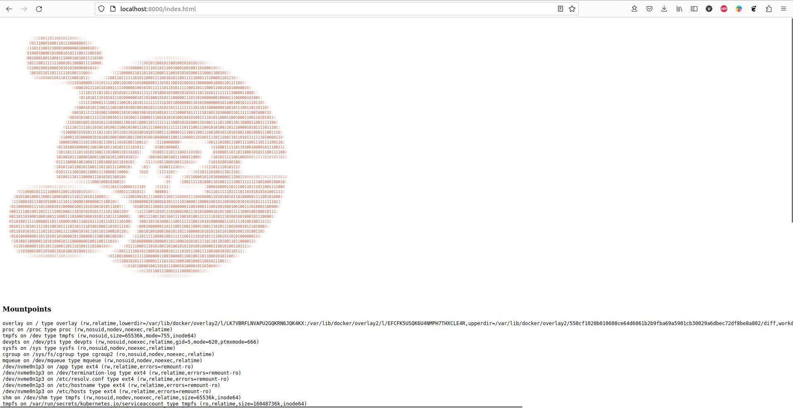
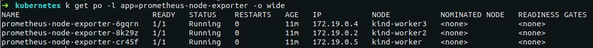
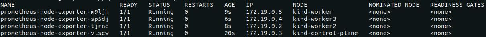

# vasilij-m_platform
vasilij-m Platform repository

## 1. Знакомство с Kubernetes, основные понятия и архитектура

<details>
  <summary><b>Выполнение заданий</b></summary>
  
  ### Задание 1
---
  **Вопрос:**  
    Разберитесь почему все pod в namespace `kube-system` восстановились после удаления.

  **Ответ:**  
    В нэймспейсе `kube-system` (minikube) запускаются следующие поды:  
    - coredns  
    - etcd  
    - kube-apiserver  
    - kube-controller-manager  
    - kube-proxy  
    - kube-scheduler  
    - registry  
    - registry-proxy  

  Поды `etcd`, `kube-apiserver`, `kube-controller-manager` и `kube-scheduler` являются static подами. Такие поды управляются напрямую `kubelet`'ом без участия компонентов Control Plane. `kubelet` следит за созданием/обновлением манифестов в директории `/etc/kubernetes/manifests` (по дефолту) и создает описанные в них поды без обращения к `kube-apiserver`. Собственно сам `kube-apiserver` и другие компоненты Control Plane создаются `kubelet`'ом при бутстрапе кластера (на самом деле это зависит от способа развертывания кластера, и Control Plane компоненты могут быть подняты как systemd сервисы, тогда манифесты для запуска их в виде static подов не нужны, как и сам `kubelet` на мастер-нодах).  
  При удалении этих подов из нэймспейса `kube-system` kubelet заново их поднимает, опираясь на манифесты в директории `/etc/kubernetes/manifests`.

  Под `coredns` заново поднимается после удаления, так как `coredns` является `deployment`'ом, и `deployment` контроллер следит, чтобы в кластере всегда было количество реплик, указанное в манифесте этого `deployment`.

  Поды `kube-proxy` и `registry-proxy` поднимаются, так как развернуты в кластере в составе `replicaset`, а `registry` - в составе `replicationcontroller`. Поведение этих контроллеров при удалении подов не отличается от `deployment`'а - они всегда восстанавливают в кластере то количество реплик, которое указано в их манифесте.

  ### Задание 2
---
  **Результат выполнения**
  
  1. Написан Dockerfile, запускающий web-сервер NGINX на порту `8000`, отдающий содержимое директории `/app` внутри контейнера (например, если в директории `/app` лежит файл `homework.html`, то при запуске контейнера данный файл должен быть доступен по URL `http://localhost:8000/homework.html`) и работающий с UID `1001`.   
  Dockerfile и конфиг для NGINX находится в директории `kubernetes-intro/web`. Образ собран и загружен в Docker Hub под тегом `vasiilij/nginx:k8s-intro`.

  2. Создан манифест `kubernetes-intro/web-pod.yaml` для запуска пода с контейнером на основе образа `vasiilij/nginx:k8s-intro`.

  3. В под к основному контейнеру добавлен init контейнер, генерирующий страницу `index.html`.

  4. Работоспособность приложения проверена (скриншот ниже):
  

  ### Hipster Shop | Задание со *
---
  **Результат выполнения**
  
  1. Причиной, по которой падал pod `frontend`, было отсутствие переменных окружения, необходимых для работы приложения.

  2. Создан манифест `kubernetes-intro/frontend-pod-healthy.yaml`, в котором для контейнера `frontend` указаны необходимые переменные окружения.

</details>

## 2. Kubernetes controllers. ReplicaSet, Deployment, DaemonSet

<details>
  <summary><b>Выполнение заданий</b></summary>
  
  ### Задание 1 (Обновление ReplicaSet)
---
  **Вопрос:**  
    Почему обновление ReplicaSet не повлекло обновление запущенных pod?

  **Ответ:**  
    После изменения в манифесте ReplicaSet версии образа для контейнера `frontend` и применения этого манифеста, в кластере остались запущены поды со старой версией приложения, то есть новые поды не запустились вместо уже запущенных. Это произошло потому, что ReplicaSet следит только за тем, чтобы количество подов в кластере с определёнными лейблами (эти лейблы указаны в селекторе ReplicaSet), совпадало с числом реплик в поле `.spec.replicas`.  
    На момент изменения версии образа в спецификации ReplicaSet, количество запущенных контейнеров с лейблом `app: frontend` уже равнялось трём, поэтому ReplicaSet не стало пересоздавать новые поды с обновленной версией приложения.

  ### Задание 2 (Deployment | Задание со *)
---
  **Результат выполнения**
  
  ***Реализация аналога blue-green развертывания:***
  1. Развертывание трех новых pod
  2. Удаление трех старых pod

  Blue-green развертывание можно реализовать следующими параметрами секции `.spec` в манифесте deployment:

  ```yaml
  strategy:
    type: RollingUpdate
    rollingUpdate:
      maxSurge: 100%        # сразу будут подняты все реплики с новой версией приложения (maxSurge: 100%),
      maxUnavailable: 0     # при этом старые реплики будут удалены только после того, как новые реплики будут готовы (maxUnavailable: 0)
  ```

  Весь манифест находится в файле `kubernetes-controllers/paymentservice-deployment-bg.yaml`.

  ***Реализация аналога Reverse Rolling Update развертывания:***
  1. Удаление одного старого pod
  2. Создание одного нового pod
  3. …

  Reverse Rolling Update развертывание можно реализовать следующими параметрами секции `.spec` в манифесте deployment:

  ```yaml
  strategy:
    type: RollingUpdate
    rollingUpdate:
      maxSurge: 0          # новая реплика приложения поднимется только после того (maxSurge: 0),
      maxUnavailable: 1    # как одна старая будет удалена (maxUnavailable: 1), и так далее, пока все старые реплики не будут заменены новыми
  ```

  Весь манифест находится в файле `kubernetes-controllers/paymentservice-deployment-reverse.yaml`.

  ### Задание 3 (Probes)
---
  **Результат выполнения**
  
  Создан манифест `kubernetes-controllers/frontend-deployment.yaml`, в котором добавлена Readiness Probe для периодеческого опроса эндпойнта `/_healthz` для контейнера `server`.

  ### Задание 4 (DaemonSet | Задание со *)
---
  **Результат выполнения**
  
  В кластере был развернут Node Exporter в виде DaemonSet.

  За основу манифеста `kubernetes-controllers/node-exporter-daemonset.yaml` был взят сгенерированный манифест `daemonset.yaml` из шаблона helm-чарта `prometheus-community/prometheus-node-exporter` командой `helm template`.

  На скриншоте показано, что поды с Node Exporter запустились только на worker нодах:
  

  Для проверки, что метрики отдаются, после применения манифеста `node-exporter-daemonset.yaml` необходимо:
  1. Пробросить порт в любой под с Node Exporter: `kubectl port-forward prometheus-node-exporter-6gqrn 9100:9100`
  2. Запросить метрики командой `curl localhost:9100/metrics` или открыть в браузере адрес http://localhost:9100/metrics

  ### Задание 5 (DaemonSet | Задание со **)
---
  **Результат выполнения**

  Для запуска подов с Node Exporter на Control plane нодах в манифест `kubernetes-controllers/node-exporter-daemonset.yaml` необходимо добавить параметры `tolerations` в `.spec.template.spec`:

  ```yaml
  tolerations:
    - key: node-role.kubernetes.io/control-plane
      operator: Exists
      effect: NoSchedule
  ```

  Это укажет планировщику Kubernetes Scheduler для подов с Node Exporter игнорировать taint `node-role.kubernetes.io/control-plane:NoSchedule`, который добавлен на Control plane ноды кластера.

  После применения манифеста `kubernetes-controllers/node-exporter-daemonset.yaml` с параметрами tolerations под с Node Exporter окажется запущен также и на Control plane ноде:
  

</details>

## 4. Настройка сервисных аккаунтов и ограничение прав для них

<details>
  <summary><b>Выполнение заданий</b></summary>
  
  ### Задание 1
---
  1. Создать Service Account `bob` , дать ему роль `admin` в рамках всего кластера
  2. Создать Service Account `dave` без доступа к кластеру

  **Результат выполнения**  

  1. Service Account `bob` и ClusterRoleBinding `admin-clusterrole` описаны в манифестах `./kubernetes-security/task01/01-sa-bob.yaml` и `./kubernetes-security/task01/02-clusterrolebinding-bob.yaml`.
  2. Service Account `dave` описан в манифесте `./kubernetes-security/task01/03-sa-dave.yaml`. Чтобы у `dave` не было доступа к кластеру достаточно просто не привязывать его к какой-либо роли через объекты RoleBinding/ClusterRoleBinding.

  ### Задание 2
---
  1. Создать Namespace `prometheus`
  2. Создать Service Account `carol` в этом Namespace
  3. Дать всем Service Account в Namespace `prometheus` возможность делать `get`, `list`, `watch` в отношении Pods всего кластера

  **Результат выполнения**

  1. Namespace `prometheus` описано в манифесте `./kubernetes-security/task02/01-namespace.yaml`.
  2. Service Account `carol` описан в манифесте `./kubernetes-security/task02/02-sa-carol.yaml`.
  3. Чтобы все сервисные аккаунты в Namespace `prometheus` имели возможность делать `get`, `list`, `watch` в отношении Pods всего кластера, нужно применить следующие манифесты:
     1.  `./kubernetes-security/task02/03-clusterrole-pods-viewer.yaml` - описывает ClusterRole `pods-viewer`
     2.  `./kubernetes-security/task02/04-clusterrolebinding-pods-viewer.yaml` - описывает ClusterRoleBinding `serviceaccounts-pods-viewer` (привязывает сервисные аккаунты из Namespace `prometheus` к ClusterRole `pods-viewer`).

  ### Задание 3
---
  1. Создать Namespace `dev`
  2. Создать Service Account `jane` в Namespace `dev`
  3. Дать `jane` роль `admin` в рамках Namespace `dev`
  4. Создать Service Account `ken` в Namespace `dev`
  4. Дать `ken` роль `view` в рамках Namespace `dev`

  **Результат выполнения**
  
  1. Namespace `dev` описано в манифесте `./kubernetes-security/task03/01-namespace.yaml`.
  2. Service Account `jane` описан в манифесте `./kubernetes-security/task03/02-sa-jane.yaml`.
  3. Манифест `./kubernetes-security/task03/03-rolebinding-jane.yaml` - описывает RoleBinding `jane-admin` в рамках Namespace `dev` (привязывает сервисный аккаунт `jane` из Namespace `dev` к ClusterRole `admin`).
  4. Service Account `ken` описан в манифесте `./kubernetes-security/task03/04-sa-ken.yaml`.
  5. Манифест `./kubernetes-security/task03/05-rolebinding-ken.yaml` - описывает RoleBinding `ken-view` в рамках Namespace `dev` (привязывает сервисный аккаунт `ken` из Namespace `dev` к ClusterRole `view`).

</details>
